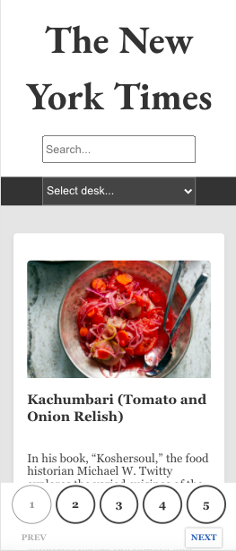

# Articles listing App

A React App that lists & filters articles using an API from NY Times.

## First add API key in env file

To run the project please add an env file with a key to the NYTimes Article Search API available at https://developer.nytimes.com/docs/articlesearch-product/1/routes/articlesearch.json/get.

### Then start the project with `npm start`

Runs the app in the development mode.\
Open [http://localhost:3000](http://localhost:3000) to view it in your browser.

## Responsive

The page adapts to any screen size. All news cards are fixed sizes, and rescalable in App.scss body. The news desk bar transforms depending on screen width by using media queries.

## Techniques used

This project was created with Create React App and using Redux as global state. Styling was created by using SCSS. For icons I used the external library of Fontawesome and also Google web fonts for text styling. I also added an svg loading animation and an svg image placeholder for any non-existing or broken image link.

## Filters

The user can use multiple searches at a time. There is a search field that instatly searches for any input in the text field at the top of the page. Also, you can select between some of the most interesting NYTimes news desk. The news desk bar is sticky to follow while scrolling and is transformed between a dropdown selection style or a navigation bar style depending on screen size. To handle Search results when you narrow down your search, I created a pagination component always available at the bottom of the page.

## The final result

The result is a one page React App, resposible and with a rescalable sizing. You can set the body font-size to your liking in App.scss file.
